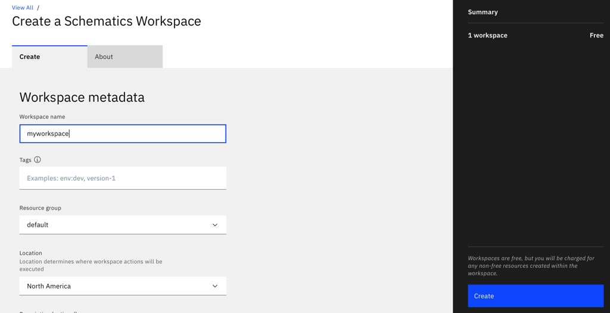
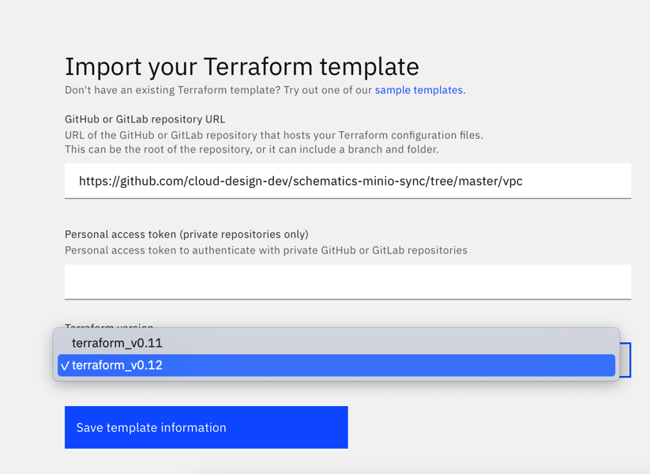
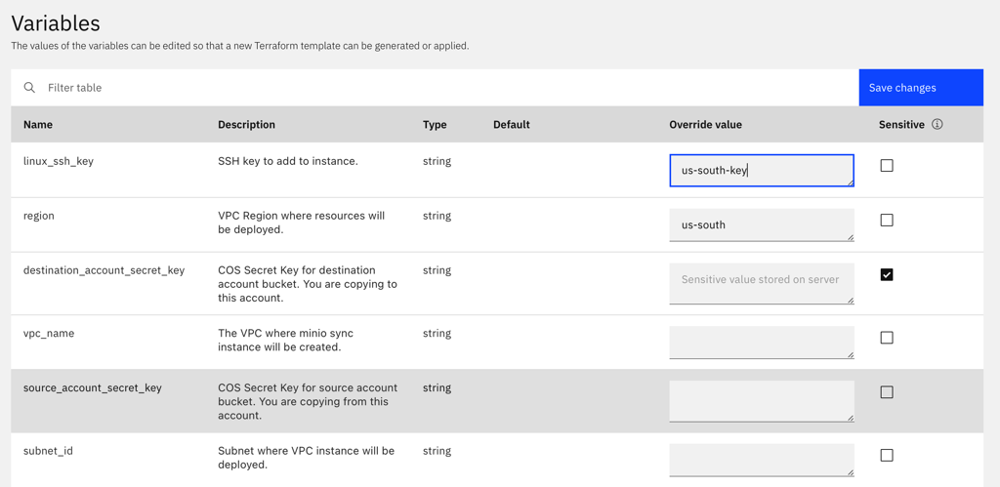

# Sync Cloud Object Storage objects between accounts.
This repo will deploy a VPC instance that is configured to copy the contents of an IBM Cloud Object Storage bucket from one account to another account. The following variables will be needed when using with Schemtatics:

## Prerequisites
 - IBM Cloud VPC
 - HMAC credentials for the source account. These credentials should be scoped to a service ID with `Reader` on the ICOS bucket. 
 - HMAC credentials for destination account. These credentials should be scoped to a service ID with `Reader` on the ICOS bucket. 

## Use with Schematics
Here are the steps to using this example with Schematics
 - Create a new Worskpace by going to the [Workspace](https://cloud.ibm.com/schematics/workspaces) page and clicking *Create workspace*
 - On the subsequent page give your workspace a name and select the Resource Group where the workspace will be deployed. Then click *Create*. 
 
 - With the workspace created should see the **Import your Terraform template** section. Put in `https://github.com/cloud-design-dev/schematics-minio-sync` under the *GitHub or GitLab repository URL* and make sure to select `terraform_v0.12` for the *Terraform version*.

 - Click Save template information. 
 - On the Workspace overview page you will now fill out the variables (see below for all variables used). Make sure the check the *Sensitive* box next to the following variables `source_account_access_key`, `source_account_secret_key`, `destination_account_access_key`, and `destination_account_secret_key`. 

## Variables
**NOTE:** Schematics sorts the Variables based on the order the API responded so you will have to do some filtering to make it easier to enter in details:

### VPC Resource Variables

Filter by key `vpc_` and fill in the following:
**vpc_os_image** - VPC Instance OS Image: Default is currently Ubuntu 18.  
**vpc_region** - VPC Region where resources will be deployed.  
**vpc_resource_group** - Resource group where resources will be deployed.  
**vpc_subnet_id** - VPC Subnet ID where the instance will be deployed.  
**vpc_ssh_key** - SSH key to add to instance. In case you need to trouble shoot the copy process. 

### Source Account Variables (You are copying **from** this account):

Filter by key `source_account_` and fill in the following:
**source_account_bucket** - Cloud Object Storage bucket name on the source account.    
**source_account_endpoint** - Cloud Object Storage endpoint on the source account.   
**source_account_access_key** - Cloud Object Storage Access Key on the source account.  
**source_account_secret_key** - Cloud Object Storage Secret Key on the source account.  

### Destination Account Variables (You are copying **to** this account):

Filter by key `destination_account_` and fill in the following:
**destination_account_bucket** - Cloud Object Storage bucket name on the destination account.   
**destination_account_endpoint** - Cloud Object Storage endpoint on the destination account.  
**destination_account_access_key** - Cloud Object Storage Access Key on the destination account.  
**destination_account_secret_key** - Cloud Object Storage Secret Key on the destination account.  

 - When you've filled out all the variables click *Save Changes*
 - Run a Schematics Plan
 - Run Schematics Apply
